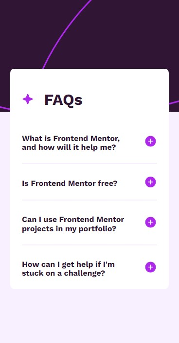

# FAQ accordion solution

This is a solution to the [FAQ accordion challenge on Frontend Mentor](https://www.frontendmentor.io/challenges/faq-accordion-wyfFdeBwBz). 

## Table of contents
  - [Overview](#overview)
  - [Links](#links)
- [My process](#my-process)
  - [Built with](#built-with)
  - [What I learned](#what-i-learned)
  - [Continued development](#continued-development)
  - [Useful resources](#useful-resources)
- [Author](#author)



## Overview

### Links

- [Solution URL here](https://github.com/CMP2007/FAQ-accordion)
- [Live site URL here](https://cmp2007.github.io/FAQ-accordion/)

## My process

### Built with

- Semantic HTML5 markup
- CSS custom properties
- Mobile-first workflow

### What I learned

Actually this is the first design practice with js in some time, on this occasion it may not be much but the biggest learning I have to highlight is using 'querySelectorAll' to obtain the array with all the elements.

All this and then use the 'forEach' method to apply the 'addEventListener' in each of the 'details' elements

```js
const details = document.querySelectorAll('details');
```
```js
details.forEach(function(item){
    item.addEventListener('click', function(e) {
        const clickedItem = this;
    })
})
```

### Continued development

At this time I want to continue doing challenges and practices based on HTML, CSS and JS to develop a good foundation before continuing with my learning path

### Useful resources

- [Video guia de la importancia y inplementacion del archivo normalice](https://www.example.com) - This video allows me to understand and apply the normalize file, an implementation that was really useful to solve certain visual regression errors that arose when uploading the project to github pages.

Therefore, this resource was very useful for the development of the challenge, without a doubt it is a small correction that will be felt in my future practices.

## Author

### Carlos Miguel Puche Moreno

- Frontend Mentor - [CMP2007](https://www.frontendmentor.io/profile/CMP2007)